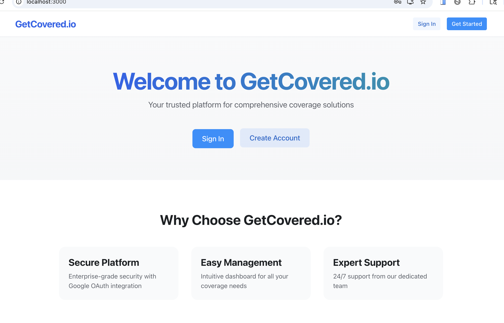
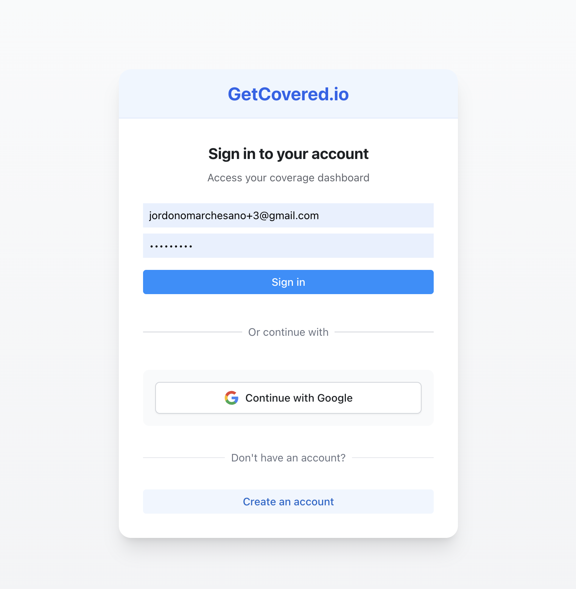
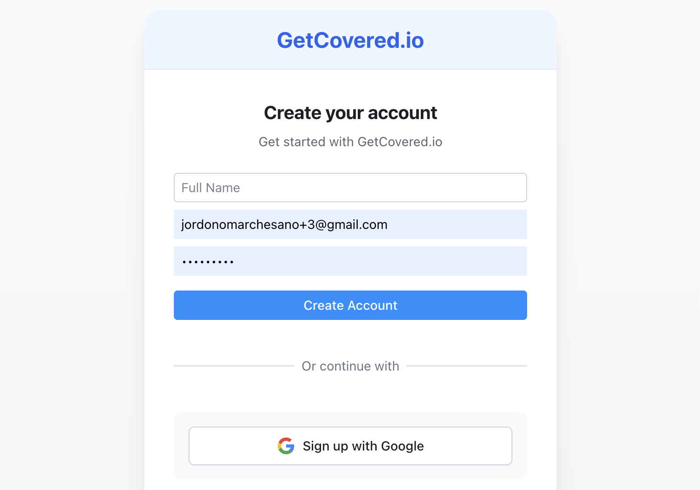
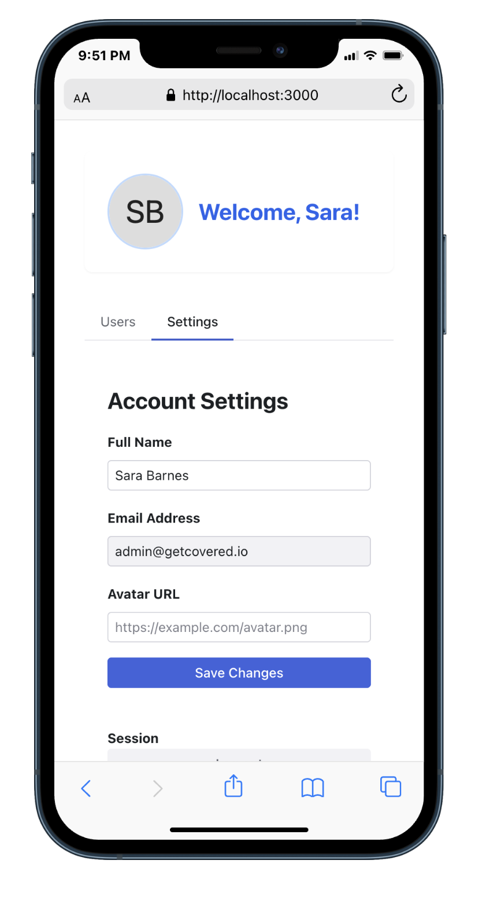
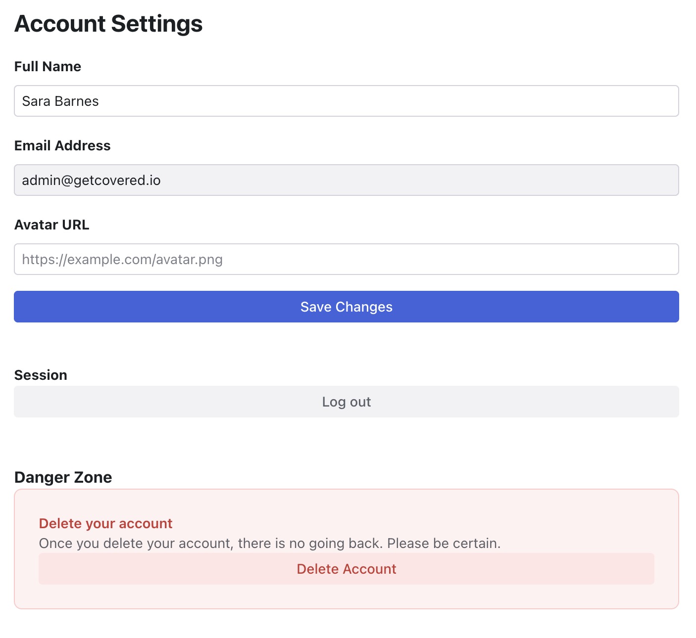
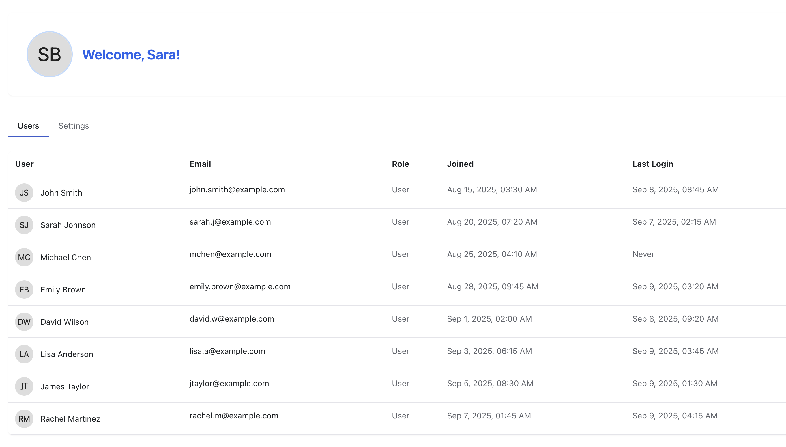

# GetCovered.io Demo

This is a full‑stack demo that showcases Google OAuth sign‑in, JWT auth, admin/user dashboards, profile management, and production‑ready SPA routing on Heroku. The backend is Flask; the frontend is React + TypeScript.

## Highlights

- Google OAuth login with JWT issuance and redirect back to the SPA
- Admin/user separation with protected routes in the SPA
- Backend API namespaced under `/api/*` to avoid SPA refresh issues
- Settings page shared by both dashboards for profile updates (name, avatar URL)
- Email is immutable (read‑only); signups and updates restricted to `@getcovered.io`
- Admin is a single seeded account: `admin@getcovered.io`
- Self account deletion, admin user management, CORS configured for local + Heroku

## Tech Stack

- Backend: Flask, Flask‑JWT‑Extended, SQLAlchemy (SQLite), Google OAuth 2
- Frontend: React + TypeScript, React Router, Axios, Tailwind utility classes, Radix UI

## Setup

1) Backend
```bash
python -m venv venv
source venv/bin/activate    # Windows: venv\Scripts\activate
pip install -r requirements.txt
```

Create `.env`
```
GOOGLE_CLIENT_ID=your_google_client_id
GOOGLE_CLIENT_SECRET=your_google_client_secret
SECRET_KEY=your_secret_key
JWT_SECRET_KEY=your_jwt_secret_key
```

Run backend
```bash
flask run
```

2) Frontend
```bash
cd frontend
npm install
npm start
```

## Deployment notes (Heroku)

- `Procfile` runs `gunicorn app:app`
- Root `package.json` runs front‑end build in `heroku-postbuild`
- React build is served from Flask: catch‑all route serves `frontend/build/index.html`
- All API endpoints are under `/api/*` so SPA routes like `/dashboard` refresh correctly
 - Data persistence uses Heroku Postgres (DATABASE_URL), not SQLite. Locally you can also point `DATABASE_URL` to the Heroku Postgres URL with `?sslmode=require` for a shared demo database.

## Key API Endpoints

- OAuth: `/login` → `/login/authorized`
- Auth status: `/api/auth/status`
- User dashboard data: `/api/dashboard`
- Admin dashboard data: `/api/admin/dashboard`
- Admin users list: `/api/admin/users`
- Admin delete user: `DELETE /api/admin/users/:id`
- Self account delete: `DELETE /api/account`
- Signup (email/password): `POST /api/signup` (restricted to `@getcovered.io`)
- Login (email/password): `POST /api/login/password`
- Update profile: `PUT /api/profile` (partial updates; email immutable, supports `avatar_img`)

## Core Architectural Decisions (Captured Prompts)

Below are condensed versions of the most important prompts that shaped the app. They reflect design/architecture choices rather than minor UI or debugging steps.

1) Core architecture — Flask + Google OAuth demo

Prompt:
> build a flask app with google oauth that only allows signups from getcovered.io. make a virtual environment and use sqlite. the signup form will use full_name and password. all stored in sqlite in a 'profiles' table. the full_name should also be taken from the google oauth metadata and stored in the profiles table for user. Sessions will be done with jwt the profiles table will have full_name, email, password(if not oauth), and avatar_img. we will take the avatar_img url from the google auth metadata as well and store this in the avatar_img. we will also be able to do crud operations on the email and password accordingly from the /dashboard section. after auth flow you will be redirected to /dashboard but if your admin "getcovered.io" email then you go to /admin/dashboard. we will use react for the front end with radix icons and tailwind this will all be deployed on Heroku

Decisions implemented:
- Flask backend with Google OAuth, JWT sessions, and SQLite `profile` table (full_name, email unique, password nullable, avatar_img, timestamps)
- React + TypeScript frontend with Radix UI and Tailwind utilities; deployed on Heroku
- Signups restricted to `@getcovered.io`; Google metadata (full name, avatar URL) captured and stored
- Post‑auth redirect to `/dashboard`; exact admin `admin@getcovered.io` redirected to `/admin/dashboard`
- Profile updates via `PUT /api/profile` (partial: name/avatar). Email later made immutable for safety
- SPA/Backend integration: React build served by Flask; API routes namespaced under `/api/*`

2) Single admin account

Prompt: “We want admin to be seated at `admin@getcovered.io`.”

Decision: Replace domain‑based admin checks with an exact match for `admin@getcovered.io` across JWT claims, route guards, and auth status.

3) Restrict signups to `@getcovered.io`

Prompts: “Only allow signups from `getcovered.io` emails.” “Block new Google OAuth signups for non‑domain users.”

Decisions:
- `/api/signup` enforces domain restriction.
- `/login/authorized` allows login for existing users but blocks creation of new users outside the domain, redirecting with `?error=domain_restricted`.

4) Persistent SPA auth with clean error UX

Prompts: “Two toasts / redirects interrupt login and admin denial.”

Decisions:
- Axios interceptor avoids redirecting when already on auth pages or during auth attempts, so error toasts render properly.
- `PrivateRoute` shows a single denial toast and redirects once.
- Login page de‑duplicates and clears `?error` from the URL.

5) Profile management rules

Prompts: “Add avatar URL support; make email read‑only; allow partial updates.”

Decisions:
- Backend `PUT /api/profile` accepts partial updates: `full_name` and/or `avatar_img`.
- Email remains immutable and always takes the JWT identity.
- Frontend sends only changed fields; Settings pre‑fills fields and grays out email.

6) Account deletion

Prompt: “Sync account deletion API with buttons in both dashboards.”

Decision: Add `DELETE /api/account` for self‑deletion; wire the Settings Danger Zone button to call it and then log out. Admin can delete other users via `DELETE /api/admin/users/:id`.

7) SPA routing & production CORS

Prompt: “Production refresh fails; make SPA work properly and set CORS for local + Heroku.”

Decisions:
- Keep React build served from Flask (catch‑all route) and restrict CORS to known origins with credentials support.

## Frontend UX Notes

- Shared `Settings` component across user/admin dashboards
- Logout moved into Settings
- Navbar adjustments on mobile (hide Get Started, responsive layout)
- Home page enter animations and staggered feature cards
- Dashboard welcome greeting always visible; avatar on the far right

## Screenshots













### Avatar handling


How it works:
- On Google OAuth sign-in, the profile picture URL from Google (`picture`) is stored as `avatar_img` in the `profile` record. If a user already exists without an avatar, it is backfilled.
- In Settings, users can paste an Avatar URL and save. The backend validates `http(s)` and updates `avatar_img` via `PUT /api/profile` (partial update), then returns a refreshed JWT with the new claims.
- Both dashboards pass an `onProfileUpdate` callback to Settings that refetches profile data after a successful save, so the header avatar updates immediately without a full page reload.

## Local Seeding (optional)

`init_db.py` seeds an admin user `admin@getcovered.io`. You can also run `add_dummy_users.py` to add sample users.

---

This README summarizes the demo’s purpose, how to run it, the architecture decisions, and the core prompts that led to those decisions.